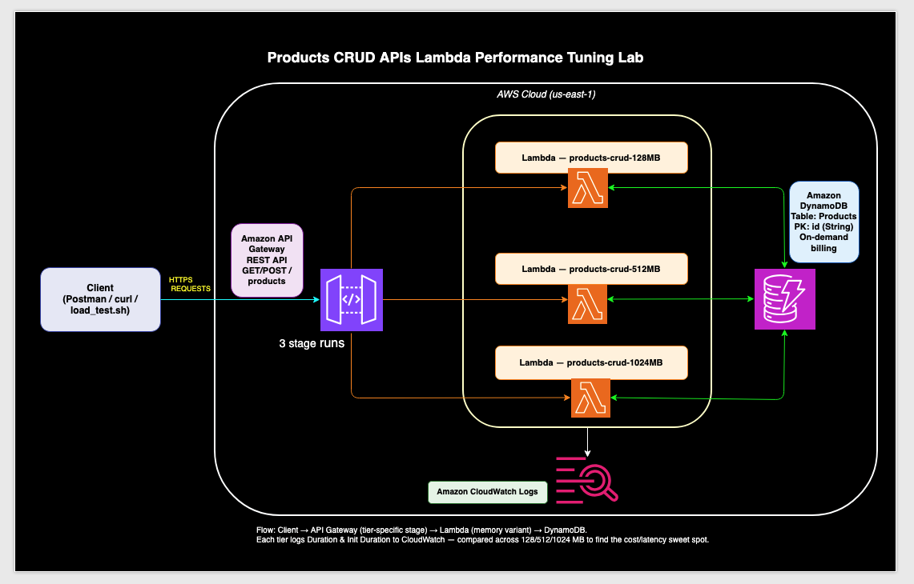

# Serverless Products API — Lambda Performance Tuning Lab

A small, deploy-in-minutes serverless project which lets you
**measure** how AWS Lambda performance changes with memory, cold/warm starts, and
traffic — using a real CRUD API

**Stack:** Amazon API Gateway (REST) → AWS Lambda (Python 3.13) → Amazon DynamoDB,
**AWS CDK (Python)** setup and teardown using commands.




---

## What makes this a *performance* lab

The stack deploys the **same Lambda code three times** at different memory sizes —
**128 MB, 512 MB, and 1024 MB** — each behind its own API Gateway stage
(`/prod-128`, `/prod-512`, `/prod-1024`). That means you can hit all three tiers
back-to-back in Postman and compare latency without redeploying anything.

Because **Lambda CPU scales with memory**, this setup makes a counter-intuitive
point easy to demonstrate: more memory often means *lower* cost per request,
because the function finishes faster.

---

## API

| Method | Route             | Action            |
|--------|-------------------|-------------------|
| POST   | `/products`       | Create a product  |
| GET    | `/products`       | List all (scan)   |
| GET    | `/products/{id}`  | Read one          |
| PUT    | `/products/{id}`  | Update            |
| DELETE | `/products/{id}`  | Delete            |

Product shape:

```json
{ "id": "P0001", "name": "Wireless Webcam", "category": "Electronics", "price": 129.99, "stock": 71 }
```

---

## Project layout

```
serverless-products-perf/
├── README.md
├── lambda/
│   └── products.py                 # CRUD handler (one fn backs all routes)
├── cdk/
│   ├── app.py                      # CDK app entry point
│   ├── cdk.json
│   ├── requirements.txt
│   └── products_perf/
│       └── products_perf_stack.py  # table + 3 Lambdas + 3 API stages
├── data/
│   └── products.json               # 200 mock products
├── scripts/
│   ├── seed_dynamodb.py            # bulk-load mock data
│   └── load_test.sh                # parallel curl load test
├── postman/
│   ├── Products-Perf.postman_collection.json
│   ├── Products-Perf-128mb.postman_environment.json
│   ├── Products-Perf-512mb.postman_environment.json
│   └── Products-Perf-1024mb.postman_environment.json
└── docs/
    ├── PERFORMANCE_TESTING.md      # the full measurement playbook
    ├── architecture.drawio         # editable diagram
    └── images/architecture.png
```

---

## Prerequisites

- An AWS account + credentials configured (`aws configure`)
- Python 3.9+ and `pip`
- Node.js + AWS CDK CLI: `npm install -g aws-cdk`
- (For testing) Postman Desktop

---

## Setup — deploy in 4 commands

```bash
cd cdk
python -m venv .venv && source .venv/bin/activate      # Windows: .venv\Scripts\activate
pip install -r requirements.txt

cdk bootstrap        # one-time per account/region
cdk deploy           # creates table + 3 Lambdas + 3 API stages
```

`cdk deploy` prints the three base URLs as outputs:

```
ProductsPerfStack.ApiUrl128MB  = https://xxxx.execute-api.us-east-1.amazonaws.com/prod-128/
ProductsPerfStack.ApiUrl512MB  = https://yyyy.execute-api.us-east-1.amazonaws.com/prod-512/
ProductsPerfStack.ApiUrl1024MB = https://zzzz.execute-api.us-east-1.amazonaws.com/prod-1024/
```

### Seed mock data

```bash
cd ..
pip install boto3
python scripts/seed_dynamodb.py            # loads data/products.json (200 items)
```

### Smoke test

```bash
curl https://xxxx.execute-api.us-east-1.amazonaws.com/prod-128/products
```

---

## Cleanup — one command

```bash
cd cdk
cdk destroy
```

The DynamoDB table uses `RemovalPolicy.DESTROY`, so this removes **everything** —
table, all three Lambdas, all three APIs, and their log groups. No stray resources,
no surprise bill.

---

## Performance testing (the main event)

Full step-by-step playbook: **[docs/PERFORMANCE_TESTING.md](docs/PERFORMANCE_TESTING.md)**

It covers:

1. **Memory tiers** — run the same request against `/prod-128`, `/prod-512`,
   `/prod-1024` and compare latency.
2. **Cold vs warm starts** — force a cold start, capture the first hit, then average
   the warm ones. Watch the cold penalty shrink as memory rises.
3. **Traffic / load** — Postman Collection Runner (100 iterations) for sustained
   load, plus `scripts/load_test.sh` for real concurrency.
4. **CloudWatch cross-check** — read `Duration`, `Init Duration`, and
   `Max Memory Used` from the `REPORT` log line. This is AWS's own measurement and
   the most credible evidence for a write-up.

### Quick start

1. Import the collection + 3 environments from `postman/` into Postman.
2. Replace `REPLACE_ME` in each environment's `baseUrl` with your real API ID/region.
3. Select a tier environment → run **List Products** → read the **Time** value.
4. Switch environments and repeat. Record results in the tables below.

### Measured results

Numbers from the actual runs in this lab (List / scan of 200 items, `us-east-1`).

**Cold start & warm latency by memory:**

| Memory  | Cold start (ms) | Warm avg (ms) | Cold penalty (ms) | Notes                          |
|:--------|----------------:|--------------:|------------------:|:-------------------------------|
| 128 MB  |            1673 |           594 |              1079 | cheapest/invoke, slowest CPU   |
| 512 MB  |            1420 |           353 |              1067 | steady-state value sweet spot  |
| 1024 MB |            1060 |           333 |               727 | best cold start & tail latency |

**Under load (Collection Runner, 100 iterations):**

| Memory  | Avg (ms) | Min (ms) | Max (ms) | Failed (>2s) |
|:--------|---------:|---------:|---------:|-------------:|
| 128 MB  |      219 |      123 |     1929 |            0 |
| 512 MB  |      119 |       69 |     1652 |            0 |
| 1024 MB |      117 |       68 |     1279 |            0 |

> 1024 MB won on every metric. The big jump is 128→512 MB (warm latency nearly
> halves, load average drops ~45%); 512→1024 MB is smaller on warm/average latency
> but still tightens cold starts and the worst-case tail. See
> [docs/PERFORMANCE_TESTING.md](docs/PERFORMANCE_TESTING.md) §6 for the full breakdown.

---

## Key takeaways this lab demonstrates

- **CPU scales with memory** on Lambda — tuning memory is really tuning CPU.
- **Cold starts** are dominated by init code; keeping the boto3 client at module
  scope (done here) and raising memory both reduce them.
- **More memory can cost less** when faster duration offsets the higher per-ms rate.
- **Measure with CloudWatch**, not just client-side timers — `Duration` and
  `Init Duration` are the numbers that matter.

---

## Notes on cost

All resources are pay-per-use (DynamoDB on-demand, Lambda per-invocation, API
Gateway per-request) and fit comfortably in the AWS Free Tier for a lab of this
size. Run `cdk destroy` when done to be safe.
