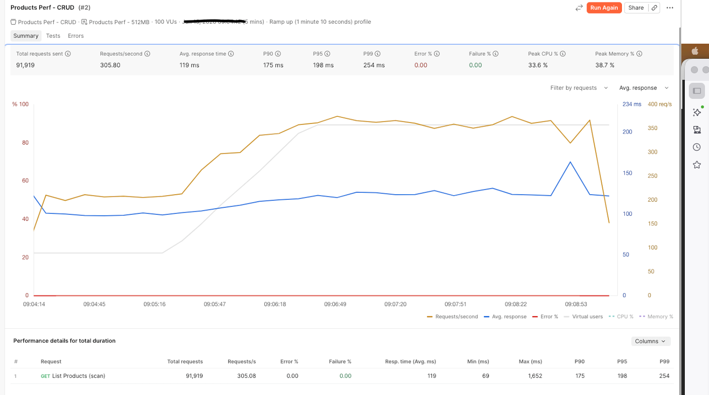
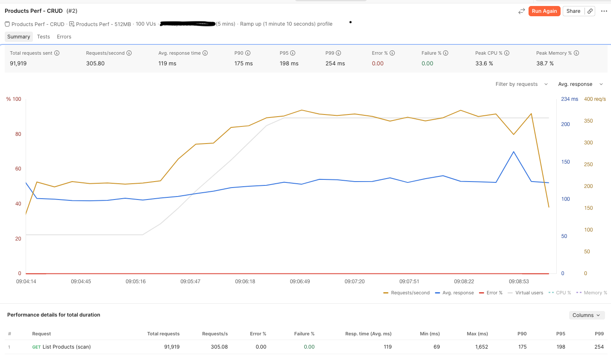
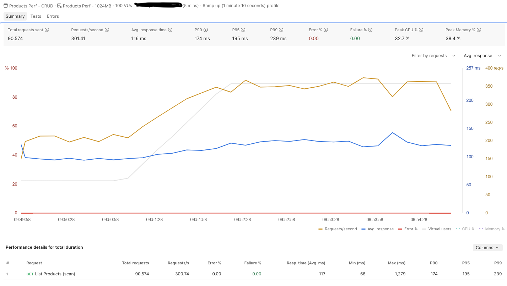

# Performance Testing Guide

This guide walks through measuring Lambda performance for the Products API across
**three dimensions**:

1. **Memory tiers** — 128 MB vs 512 MB vs 1024 MB
2. **Cold start vs warm start** — first invoke after deploy vs steady state
3. **Traffic / concurrency** — light vs sustained load using Postman's runner

> Why this matters: on Lambda, **CPU scales linearly with memory**. A 1024 MB
> function gets roughly 8x the CPU of a 128 MB function, so a CPU-bound or
> serialization-heavy handler can actually be *cheaper* at higher memory because
> it finishes much faster. The whole point of this lab is to *measure* that
> instead of guessing.

---

## 0. Prerequisites

- The stack is deployed (`cdk deploy`) and the table is seeded (`seed_dynamodb.py`).
- You have the three Invoke URLs from the `cdk deploy` outputs (`ApiUrl128MB`,
  `ApiUrl512MB`, `ApiUrl1024MB`).
- Postman Desktop installed (the Collection Runner is used for load tests).

Import these into Postman:

- `postman/Products-Perf.postman_collection.json`
- `postman/Products-Perf-128mb.postman_environment.json`
- `postman/Products-Perf-512mb.postman_environment.json`
- `postman/Products-Perf-1024mb.postman_environment.json`

Then edit each environment's `baseUrl` and replace `REPLACE_ME` (and the region
if you didn't deploy to `us-east-1`) with your real API ID, e.g.
`https://a1b2c3d4e5.execute-api.us-east-1.amazonaws.com/prod-128`.

---

## 1. Measuring a single request's latency

1. Select the **Products Perf - 128MB** environment (top-right dropdown).
2. Open **List Products (scan)** and click **Send**.
3. Read the **Time** value next to the response status (e.g. `Time: 320 ms`).
4. The test scripts also log timing to the **Console** (`View > Show Postman Console`).

Postman's `Time` is end-to-end (DNS + TLS + API Gateway + Lambda + DynamoDB +
network). To isolate the *Lambda* portion, cross-check with CloudWatch (Section 5).

---

## 2. Cold start vs warm start

A **cold start** happens when Lambda has to spin up a fresh execution environment
(first request, or after ~5-15 min idle, or when scaling out). It adds the runtime
init + your module-level code (importing boto3, creating the DynamoDB client).

**To force a cold start:** redeploy the function, OR wait ~10 minutes idle, OR
bump an environment variable. The simplest reliable method in this lab is to
re-run `cdk deploy` (the new version always cold-starts on first hit).

**Procedure per memory tier:**

1. Trigger a cold start (redeploy, or wait).
2. Send **List Products** once — record this as the **cold** number.
3. Immediately send it 9 more times — average those as the **warm** number.
4. Repeat for 512 MB and 1024 MB environments.

Record results like this:

| Memory  | Cold start (ms) | Warm avg (ms) | Cold penalty (ms) |
|:--------|----------------:|--------------:|------------------:|
| 128 MB  |            1673 |           594 |              1079 |
| 512 MB  |            1420 |           353 |              1067 |
| 1024 MB |            1060 |           333 |               727 |

> Expected shape: the **cold penalty shrinks** as memory rises, because init code
> runs on more CPU. Warm latency also usually drops with memory, up to a point of
> diminishing returns — finding that point is the tuning win.

---

## 3. Traffic / load testing with the Collection Runner

The Collection Runner replays requests N times. Use it to see how latency holds up
under sustained traffic and whether higher memory absorbs load better.

1. Click the collection's **...** menu > **Run collection**.
2. Choose the **List Products (scan)** request only (uncheck the others to keep the
   run focused on the read-heavy, memory-sensitive route).
3. Set **Iterations** to `100` and **Delay** to `0 ms`.
4. Pick the **128MB** environment, click **Run**.
5. After the run, open the **summary**: note **Avg. Response Time** and the
   min/max. Postman also shows the per-request pass/fail for the latency assertion.
6. Repeat with **512MB** and **1024MB** environments.

Record:

| Memory  | Iterations | Avg (ms) | Min (ms) | Max (ms) | Failed (>2s) |
|:--------|-----------:|---------:|---------:|---------:|-------------:|
| 128 MB  |        100 |      219 |      123 |     1929 |            0 |
| 512 MB  |        100 |      119 |       69 |     1652 |            0 |
| 1024 MB |        100 |      117 |       68 |     1279 |            0 |

Postman Collection Runner output for each tier:







**Heavier traffic (concurrency):** Postman's runner is sequential. For *concurrent*
load that triggers multiple cold starts and real scaling, use the bundled
`scripts/load_test.sh` (parallel curl) or [Artillery](https://www.artillery.io/):

```bash
# 50 requests, 10 in parallel, against one tier
./scripts/load_test.sh "https://REPLACE_ME.execute-api.us-east-1.amazonaws.com/prod-128/products" 50 10
```

---

## 4. A full CRUD latency pass

To compare *every* operation (create/read/update/delete/list) per tier:

1. Select a tier environment.
2. Run the whole collection (all 5 requests) for **20 iterations**.
3. In the run summary, expand each request to see its average — `create` and
   `list` are the most interesting; `read`/`delete` by primary key are near-flat.

This is the table that goes in the README results section.

---

## 5. Cross-checking with CloudWatch (the source of truth)

Postman measures *client-perceived* latency. To see the *billed Lambda duration*
and cold-start init time:

1. AWS Console > **CloudWatch > Log groups** > `/aws/lambda/products-crud-128mb`.
2. Open the latest log stream. Each invocation ends with a `REPORT` line:

   ```
   REPORT RequestId: ...  Duration: 18.42 ms  Billed Duration: 19 ms
   Memory Size: 128 MB  Max Memory Used: 71 MB  Init Duration: 412.55 ms
   ```

   - **Duration** = actual handler execution (what memory tuning improves).
   - **Init Duration** = cold-start cost (only present on cold invocations).
   - **Max Memory Used** = tells you if you over-provisioned (e.g. used 71 MB of
     1024 — you're paying for headroom you don't need).

3. Compare `Duration` and `Init Duration` across the three log groups. This is the
   most credible evidence for a LinkedIn write-up because it's AWS's own number.

> **Pro move:** run `Max Memory Used` against `Memory Size`. The sweet spot is the
> lowest tier where `Duration` has stopped improving meaningfully — that's the
> cost-optimal config. AWS Lambda Power Tuning automates exactly this sweep if you
> want to take it further.

---

## 6. Measured results

Numbers from the actual runs in this lab (List / scan of 200 items, `us-east-1`).
Yours will vary by region and table size, but the *shape* held across every metric:

| Memory  | Cold start | Cold penalty | Warm avg | Load avg | Load max |
|:--------|-----------:|-------------:|---------:|---------:|---------:|
| 128 MB  |    1673 ms |      1079 ms |   594 ms |   219 ms |  1929 ms |
| 512 MB  |    1420 ms |      1067 ms |   353 ms |   119 ms |  1652 ms |
| 1024 MB |    1060 ms |       727 ms |   333 ms |   117 ms |  1279 ms |

**1024 MB came out ahead on every measure** — fastest cold start, smallest cold
penalty, lowest warm latency, lowest load average, and the tightest tail (max).
The biggest single jump is **128 → 512 MB** (warm latency nearly halves, load
average drops ~45%). The **512 → 1024 MB** step is smaller on warm/average latency
(353 → 333 ms, 119 → 117 ms) but still meaningfully improves cold starts (1420 →
1060 ms) and the worst-case tail (1652 → 1279 ms).

The takeaway: **more memory is not always more cost.** Because duration drops as
memory rises, the higher tiers can cost *less per request* despite the higher
per-millisecond rate — while also being ~2-3x faster. Here, 512 MB is the value
sweet spot for steady-state latency, and 1024 MB is the pick if cold starts and
tail latency matter. Measure, don't assume.
